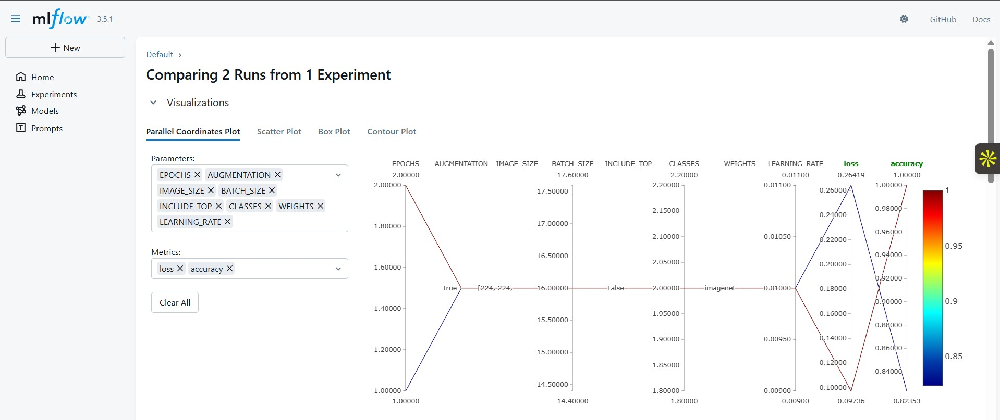
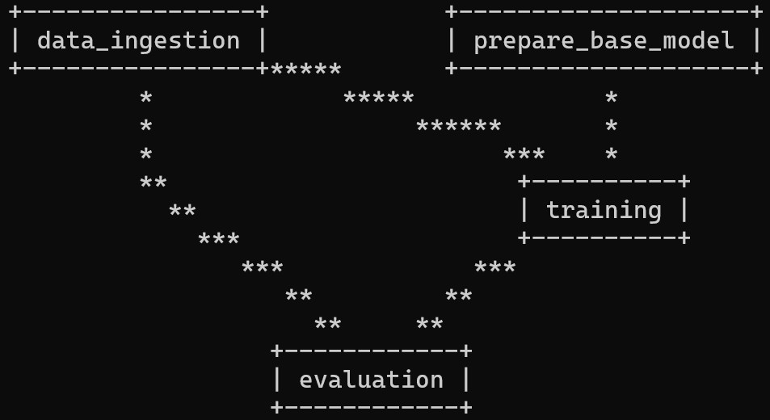
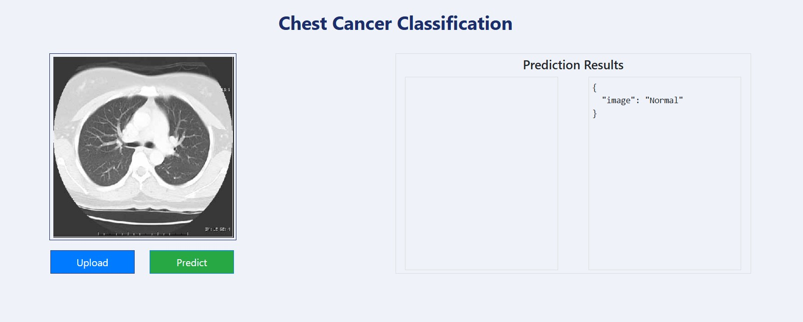

# Chest Cancer Detection — End-to-End ML Pipeline

 
 
 
 


---

## 📌 Project Overview

This project implements an **end-to-end deep learning pipeline** for detecting **chest illnesses from CT scan images**.  
The pipeline is **reproducible, automated, and deployable locally**.  

Key features include:  
- **DVC pipeline**: Data ingestion → Preprocessing → Model training → Evaluation  
- **MLflow tracking**: Experiments, parameters, metrics  
- **Dockerized Flask API**: Model served locally  
- **GitHub Actions CI**: Automates DVC runs and Docker builds  

---

##  Project Structure

```
project-root/
├── app.py                     # Flask API entry point
├── main.py                    # Script to run pipeline or model
├── Dockerfile                 # Docker deployment file
├── requirements.txt           # Python dependencies
├── dvc.yaml                   # DVC pipeline definition
├── dvc.lock                   # DVC lock file
├── params.yaml                # Pipeline parameters
├── model/
│   └── model.h5               # Trained model
├── config/
│   └── config.yaml            # Configuration file
├── src/
│   └── CNN_classifier/
│       ├── components/        # Core components like data ingestion, model trainer, evaluation
│       ├── pipeline/          # Pipeline stages
│       │   ├── stage_01_data_ingestion.py
│       │   ├── stage_02_prepare_base_model.py
│       │   ├── stage_03_model_trainer.py
│       │   └── stage_04_model_evaluation.py
│       ├── config/            # Project configuration modules
│       ├── constants/         # Constant values
│       ├── entity/            # Data classes and entities
│       └── utils/             # Helper functions
├── research/                  # Notebooks for experimentation
│   ├── 01_data_ingestion.ipynb
│   ├── 02_prepare_base_model.ipynb
│   ├── 03_model_trainer.ipynb
│   └── 04_model_evaluation.ipynb
├── templates/
│   └── index.html             # Frontend template for Flask app
└── .github/workflows/ci.yaml  # GitHub Actions CI pipeline
```


---

## 🚀 Quick Start

### 1️⃣ Clone repository
```bash
git clone https://github.com/Mariem17-17/End_To_End_Chest_Cancer_Detection.git
cd End_To_End_Chest_Cancer_Detection
```

### 2️⃣ Install dependencies

```bash
pip install --upgrade pip
pip install -r requirements.txt
```
### Run DVC pipeline
```bash
dvc init
dvc repro
```

### 4️⃣ Start Flask API

```bash
python app.py
```

### 5️⃣ Docker Deployment
```bash
docker build -t ml-flask-app .
docker run -p 8080:8080 ml-flask-app
```

## 🧰 Tech Stack

- **Languages:** Python  
- **Deep Learning:** TensorFlow, NumPy, SciPy  
- **MLOps / Workflow Tools:** DVC, MLflow, GitHub Actions
- **Web / API:** Flask, Flask-Cors  
- **Deployment:** Docker

## ✅ Key Achievements

- Built reproducible ML pipeline with DVC for CT scan data processing

- Tracked experiments, metrics, and models using MLflow

- Deployed inference service as a Dockerized Flask API for local usage

- Automated pipeline execution and Docker builds via GitHub Actions CI

## 💡Visualizations

1. **MLflow Model Comparison**  
   Include a screenshot showing different models, metrics, and comparisons in MLflow.  
   Example:

   

2. **DVC Pipeline Diagram**  
   Visualize the stages of your pipeline:  
   Data Ingestion → Preprocessing → Model Training → Evaluation → Prediction.  
   Example:

   

3. **Flask App Demo (GIF)**  
   Show the Flask API running locally and making predictions.  
   Example:

   